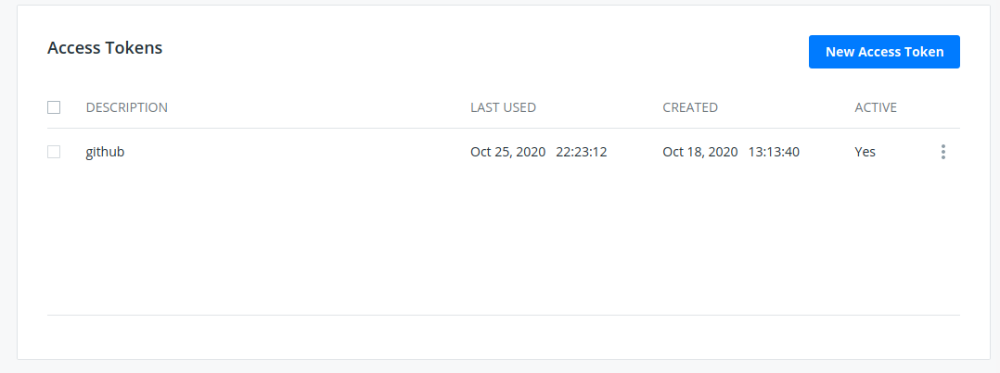

# Integración continua

## Testing

### Generación automática de los contenedores para testing

Los contenedores para testing son generados automática cada vez que es
necesario. Para ello he usado una estrategia en [github actions](https://github.com/yabirgb/bukhgalter/blob/master/.github/workflows/testing.yml) que se ejecuta 
de manera inteligente:

- En primer lugar si estudia si se ha modificado el archivo `Dockerfile`
   correspondiente o el archivo de dependencia `Cargo.tolm`. También se mira se
   modifican los archivos de `CI` por si se hubiesen cambiando las estrategias.

- Si hay cambios en los archivos anteriores se construyen los contenedores y se
  publican tanto a `dockerhub` como a `github container repository`.

- En caso de no haber cambios se procede con el siguiente paso que es la
  ejecución de los tests utilizando el contenedor que se encuentra disponible en
  `dockerhub`.

### Cómo se ha configurado el despliegue

Para realizar el despliegue en `dockerhub` se han seguido los siguientes pasos:

1. Crear una cuenta en `dockerhub` con el mismo nombre de usuario que en github.
2. Crear un token para el acceso a la cuenta de `dockerhub`

3. Este token se ha añadido junto al nombre de usuario a los `secrets` del
   repositorio de github

4. Se ha configurado en `github actions` los datos de usuario usando el token
   creado para publicar los contenedores.

En el caso de los repositorios de `github` ha sido necesario crear un token de
acceso que también se ha añadido a los `secrets` del repositorio y se ha añadido
también al `actions` para los tests.

### Problemas encontrados

Durante el desarrollo del archivo para el `workflow` me he encontrado con varios
problemas:

- La documentación relacionada con la `action` oficial de docker no estaba muy
  clara y la que proveía github al respecto usaba una versión antigua. Además en
  el `marketplace` se enlazaba a una versión antigua de esta `action` y no a la última del repositorio. Finalmente me decidí a usar otra imagen del `marketplace` que también
  me permitía publicar mis contenedores
- La información del repositorio de github para contenedores también era confusa
  y hacía referencia a dos repositorios distintos, uno de los cuales parece estar 
  ya en desuso. Es por esto que no he encontrado documentación consistente en la página de github y subo mi imagen usando ordenes de docker, en lugar de usar algun action oficial. 
- También tuve problemas con las condiciones para construir los contenedores o
  no construirlos en función de los archivos cambiados. Finalmente me decanté
  por buscar en el `marketplace` un `action` que me permitía hacer lo que
  buscaba.
- Además se ha encontrado un problema con la ejecución de los tests en el
  contenedor usando un usuario distinto al de root. Este problema se ha 
  discutido en [contenerizacion](contenerizacion.md)

## Fuentes

- [https://github.com/marketplace/actions/docker-login#github-container-registry](https://github.com/marketplace/actions/docker-login#github-container-registry)
- [https://github.com/marketplace/actions/publish-docker](https://github.com/marketplace/actions/publish-docker)
- [https://github.com/dorny/paths-filter](https://github.com/dorny/paths-filter)
- [https://docs.github.com/en/free-pro-team@latest/packages/getting-started-with-github-container-registry/migrating-to-github-container-registry-for-docker-images](https://docs.github.com/en/free-pro-team@latest/packages/getting-started-with-github-container-registry/migrating-to-github-container-registry-for-docker-images)