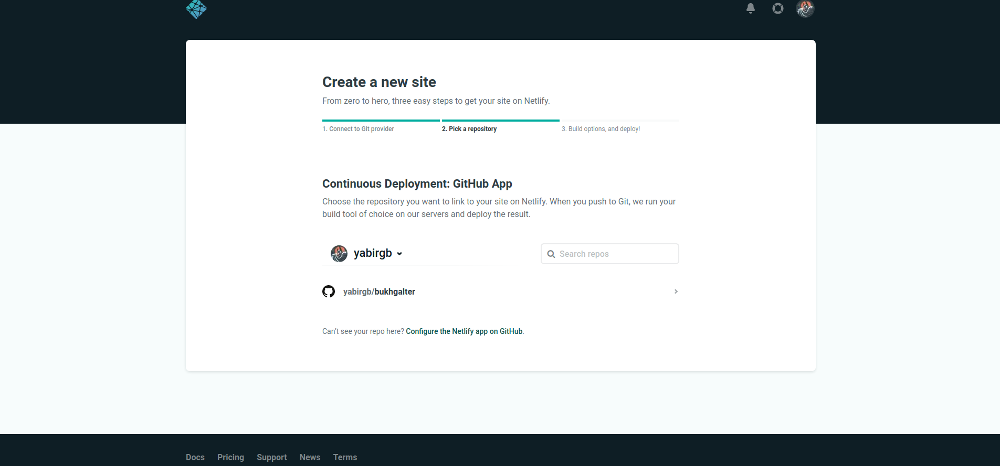

# Desplegado en netlify

Tras hacer loguin en la página de netlify nos aparece la siguiente ventana. Aquí hacemos click en `New site from Git`

Llegamos a una página donde nos guía para enlazar un proyecto

Seleccionamos el proyecto que queremos enlazar

A continuacón, dado que la configuración de mi proyecto es un poco especial he
creado un archivo [netlify.toml](https://github.com/yabirgb/bukhgalter/blob/master/netlify.toml)

    [build]
    base = "ui/"
    publish = "public/"
    command = "npm run build"

En este documento le estamos indicando que la carpeta en la que tiene que
trabajar en la carpeta `ui`. Además le decimos que tiene que publicar el contenido 
de la carpeta `publish` tras ejecutar la orden `npm run build`. 

Con estas indicaciones netlify ya sabe como debe construir nuestro proyecto y
las builds se activan de manera automática cada vez que se hace commit. Como
último paso le he asignado un dominio desde la interfaz de netlify. El proyecto
está disponible en [bukhgalter.netlify.app/](bukhgalter.netlify.app/). Se pueden
consultar las estadísticas de la construcción en
[https://app.netlify.com/sites/bukhgalter/deploys/5fbaa4e84c0b4b61d33ffdc2](https://app.netlify.com/sites/bukhgalter/deploys/5fbaa4e84c0b4b61d33ffdc2)

El sitio queda finalmente así:

